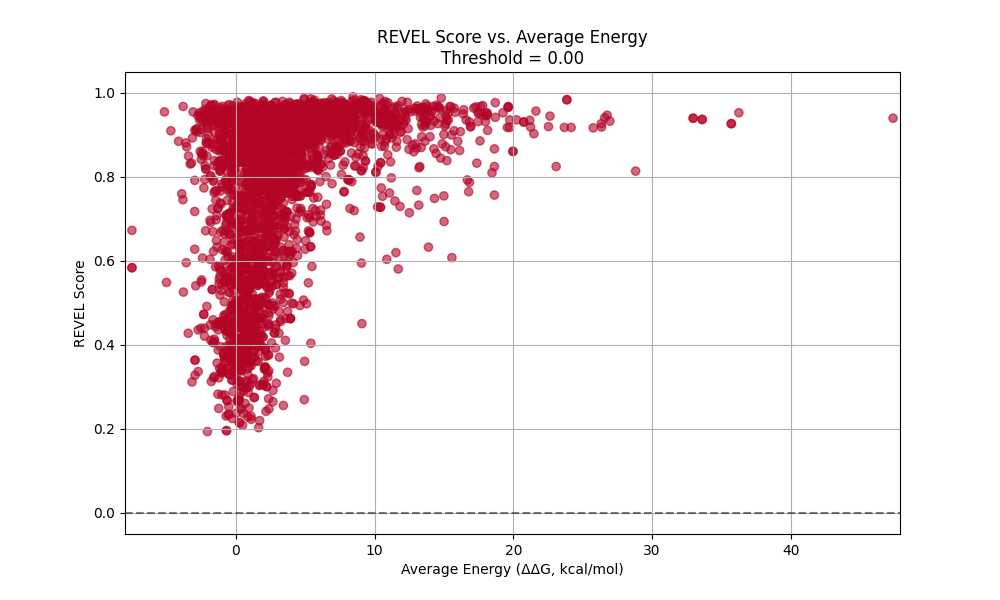

# COMPUTATIONAL-MODELLING-OF-CANCER-
Reconciling Mutation Predictions from Different Models

### 🔬 Model Comparison Animations

<table>
  <tr>
    <td align="center"><b>REVEL vs. Binding Site</b> </td>
    <td align="center"><b>REVEL vs. Destabilizing Energy</b> </td>
    <td align="center"><b>REVEL vs. Hinge Site</b> </td>
  </tr>
</table>

## Summary
Simply put, the project is based on comparing and reconciling mutation predictions for a gene called Fumerate Hydratase using different computational models. 

The predictions come from two different models, REVEL ( a statistical model) and a mechanistic model trained on patient data published by Dr. Shorthouse et al. Both models predict whether a mutation is disease causing or not (pathogenic or benign) but disagree on certain predictions, and the goal is to understand how (and whether) they can be reconciled. I’m working on this project under the supervision of Dr. Ben Hall at UCL. 

## ​Why it matters
FH gene mutations have been directly linked to ​late onset kidney cancer, and understanding both the scope and severity of FH mutations can improve our understanding of the disease. Therefore, an accurate model that incorporates both statistical power from REVEL and the biophysical explanations together with patient data from the mechanistic model could potentially aid in early cancer detection. 

## ​What I'm Currently Doing
​What makes the project quite exciting is its unique blend of different fields, with a heavy emphasis on computing(data science) plus elements from physics(mostly biophysics) and biology. 

As a physicist, I've found working biological data intriguing, though a occasionally frustrating as it has a lot of nuance when it comes to handling noise, duplications and missing data (relative to my usual physical data). 

​So far, in summary, I have managed to ​

1. Export, clean and merge two datasets with thousands of unique FH mutation data. 

2. ​Handle duplicated and missing data appropriately ​

3. Conduct sensitivity and specificity analysis to identify the optimum cutoff point for REVEL that minimizes disagreement between the two models. ​​​

**Code will be uploaded once the project is concluded**
​
